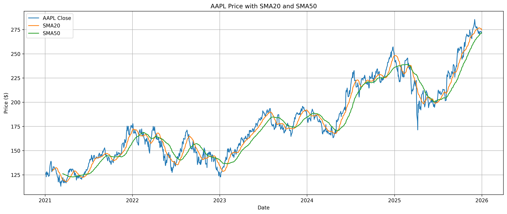
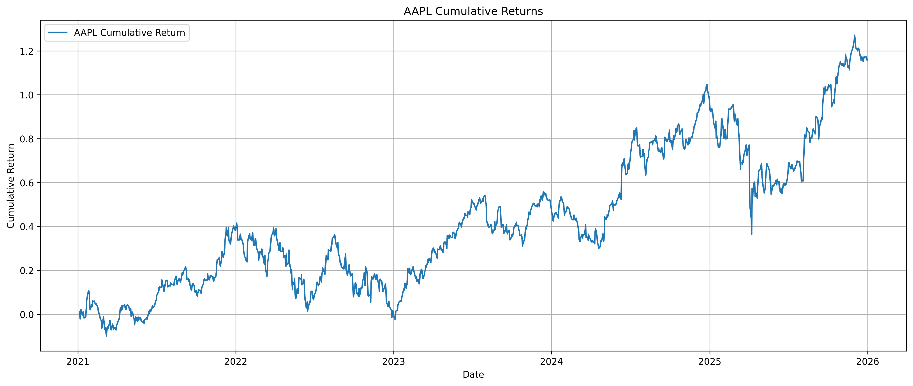
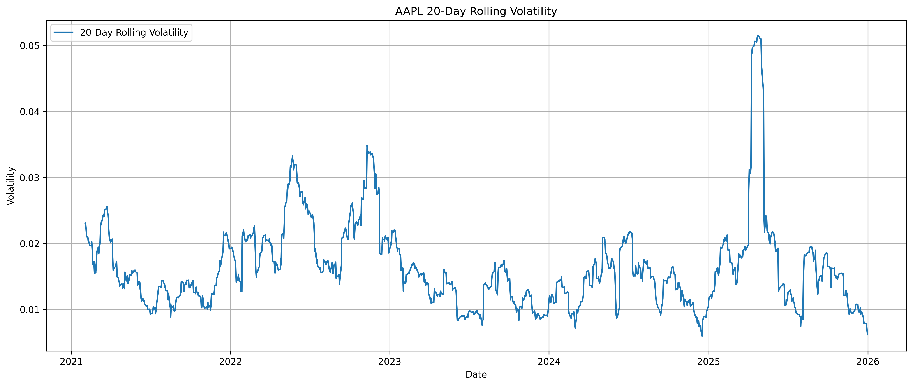
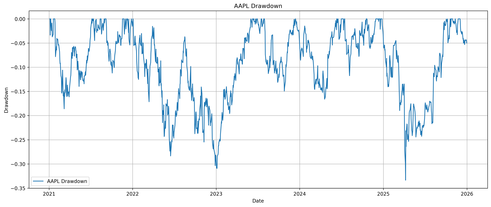
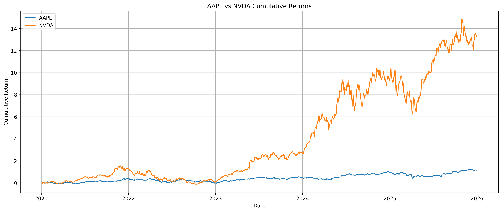

# Quant Market Analysis: AAPL & NVDA

## Overview

This project performs a quantitative analysis of Apple (AAPL) and NVIDIA (NVDA) using historical market data from January 2021 through December 2025.

The analysis focuses on understanding **returns, risk, volatility, drawdowns, moving averages, and the relationship between two major technology stocks**.

The project was built using Python and focuses on developing practical skills in financial data analysis and quantitative research.

## Objectives

* Analyze historical AAPL price data
* Calculate daily and cumulative returns
* Measure daily and annualized volatility
* Calculate 20-day and 50-day simple moving averages
* Analyze rolling volatility
* Measure maximum drawdown
* Compare AAPL and NVDA returns
* Calculate the correlation between AAPL and NVDA
* Summarize key performance statistics
* Visualize the results

## Data

Historical market data was downloaded using `yfinance`.

**Assets analyzed:**

* AAPL — Apple Inc.
* NVDA — NVIDIA Corporation

**Analysis period:** January 2021 – December 2025

The analysis primarily uses closing prices and daily returns.

## Methodology

### 1. Daily Returns

Daily percentage returns were calculated using:

```python
aapl_returns = aapl_close.pct_change()
```

This measures the percentage change in AAPL's closing price from one trading day to the next.

### 2. Cumulative Returns

Cumulative returns were calculated by compounding daily returns:

```python
aapl_cumulative_returns = (1 + aapl_returns).cumprod() - 1
```

This shows the overall growth of an initial investment over the analysis period.

### 3. Volatility

Daily volatility was calculated using the standard deviation of daily returns.

Annualized volatility was then estimated using approximately 252 trading days per year:

```python
aapl_annual_volatility = aapl_daily_volatility * np.sqrt(252)
```

### 4. Moving Averages

Two simple moving averages were calculated:

* 20-day SMA
* 50-day SMA

These were used to examine short- and medium-term price trends.

### 5. Rolling Volatility

A 20-day rolling standard deviation of daily returns was calculated to observe how AAPL's volatility changed over time.

### 6. Maximum Drawdown

Drawdown was calculated relative to the running maximum price:

```python
aapl_running_max = aapl_close.cummax()
aapl_drawdown = (aapl_close / aapl_running_max) - 1
```

Maximum drawdown represents the largest decline from a previous peak during the analyzed period.

### 7. Correlation

AAPL and NVDA daily returns were combined and their correlation matrix was calculated.

This helps measure the degree to which the two stocks' daily returns moved together during the analysis period.

## Performance Statistics

The analysis calculated:

| Metric                |   Result |
| --------------------- | -------: |
| Total Return          | ~115.81% |
| Average Daily Return  | ~0.0767% |
| Annualized Volatility |  ~27.86% |
| Maximum Drawdown      | ~-33.36% |
| Best Trading Day      | ~+15.33% |
| Worst Trading Day     |  ~-9.25% |
| Positive Trading Days |      665 |
| Negative Trading Days |      586 |
| AAPL–NVDA Correlation |    ~0.52 |

## Visualizations

### AAPL Price with Moving Averages



### AAPL Cumulative Returns



### AAPL Rolling Volatility



### AAPL Drawdown



### AAPL vs NVDA Cumulative Returns



## Key Findings

* AAPL generated a strong cumulative return over the analyzed period.
* The stock experienced meaningful volatility, with annualized volatility of approximately 27.86%.
* The maximum drawdown was approximately -33.36%, demonstrating that strong long-term returns can still involve substantial periods of decline.
* AAPL had more positive trading days than negative trading days.
* The correlation between AAPL and NVDA daily returns was approximately 0.52, indicating a moderate positive relationship during the analyzed period.
* The cumulative-return comparison provides a visual comparison of the performance of the two stocks over the same period.

## Technologies Used

* Python
* Pandas
* NumPy
* Matplotlib
* yfinance
* Jupyter Notebook

## Project Structure

```text
quant-market-analysis/
│
├── quant_market_analysis.ipynb
├── README.md
│
└── images/
    ├── aapl_price_sma.png
    ├── aapl_cumulative_returns.png
    ├── aapl_rolling_volatility.png
    ├── aapl_drawdown.png
    └── aapl_vs_nvda_returns.png
```

## How to Run

1. Clone the repository.
2. Install the required Python libraries:

```bash
pip install numpy pandas matplotlib yfinance jupyter
```

3. Open the notebook:

```bash
jupyter notebook quant_market_analysis.ipynb
```

4. Run the cells from top to bottom.

## Disclaimer

This project is for educational and research purposes only. The analysis is based on historical market data and does not constitute financial advice or a recommendation to buy or sell any security.
